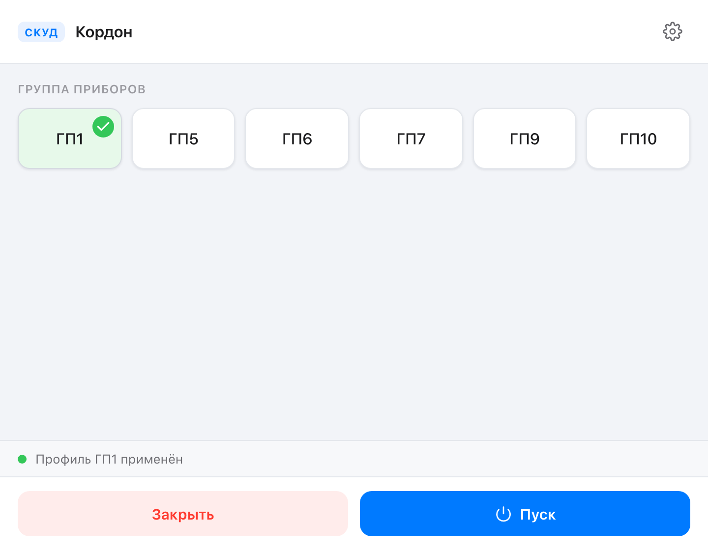
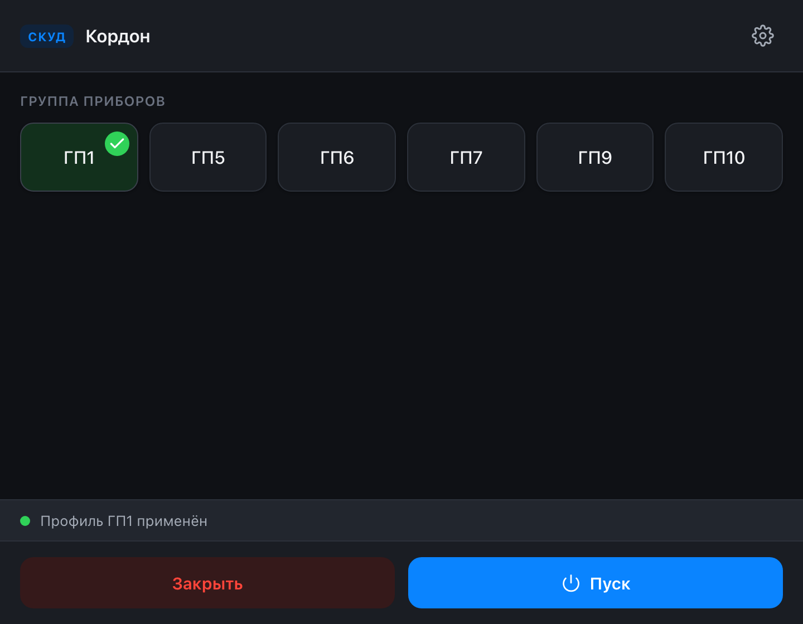
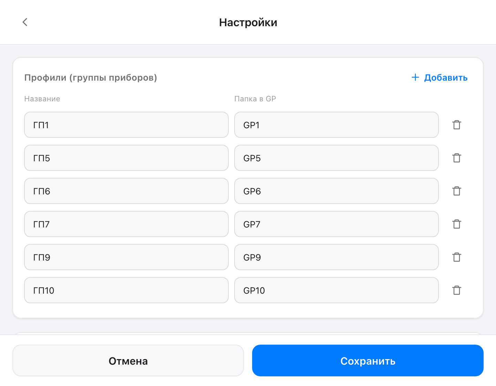

<div align="center">


# Кордон

**Настольная утилита СКУД для ParsecNET** — переключение профилей контрольно‑пропускных пунктов в один клик.

[](LICENSE)


</div>

Оператор поста выбирает группу приборов (ГП) — приложение подменяет `parsec.ini`
конфигом выбранного профиля, запускает ParsecNET, а при выходе удаляет
применённый конфиг. Раньше это была утилита на Electron; версия 2.0 полностью
переписана на **Tauri v2** — лёгкий нативный бинарь под Windows, с обновлённым
дизайном и экраном настроек.

## Скриншоты

<table>
  <tr>
    <td width="50%"></td>
    <td width="50%"></td>
  </tr>
  <tr>
    <td align="center"><sub>Главный экран — светлая тема</sub></td>
    <td align="center"><sub>Главный экран — тёмная тема</sub></td>
  </tr>
  <tr>
    <td colspan="2"></td>
  </tr>
  <tr>
    <td colspan="2" align="center"><sub>Настройки — редактор профилей, пути, тема</sub></td>
  </tr>
</table>

## Возможности

- **Один клик — один пост.** Сетка кнопок ГП с явной подсветкой применённого
  профиля и статус‑строкой, что именно сейчас активно.
- **Пуск / Закрыть.** «Пуск» запускает ParsecNET, «Закрыть» удаляет применённый
  `parsec.ini` и выходит.
- **Настраиваемые профили.** Список ГП редактируется прямо в приложении
  (добавить / удалить / переименовать) — больше никакого ручного JSON.
- **Гибкие пути.** Путь к программе, целевому `parsec.ini` и папке профилей GP —
  всё в настройках.
- **Темы оформления.** Светлая, тёмная и системная.
- **Портативность.** Относительная папка GP резолвится рядом с `.exe`, так что
  раскладка «папка GP рядом с приложением» работает из коробки.

## Как это работает

Каждый профиль — это папка внутри «папки профилей GP» с файлом `parsec.ini`.
По клику `<gpFolder>/<профиль>/parsec.ini` копируется в целевой путь ParsecNET.
Настройки хранятся в `%APPDATA%/com.kordon.app/settings.json`.

## Технологии

| Слой | Стек |
|------|------|
| Оболочка | [Tauri v2](https://v2.tauri.app/) (Rust) |
| Бэкенд | Rust — работа с файлами, запуск процессов, хранение настроек |
| Фронтенд | React 18 + TypeScript + Vite |
| Стили | Нативный CSS с дизайн‑токенами и тёмной темой |

Логика бэкенда — пять команд Tauri (`load_settings`, `save_settings`,
`apply_profile`, `run_program`, `close_and_cleanup`) в `src-tauri/src/`.

## Установка

Готовые установщики (NSIS `.exe` и `.msi`) собираются из исходников под Windows —
см. ниже. Приложению нужны права администратора для записи в защищённую папку
ParsecNET (манифест `requireAdministrator` уже вшит — UAC спросит один раз).

## Сборка из исходников

Нужны [Node.js](https://nodejs.org/) 18+ и [Rust](https://rustup.rs/) (stable)
с [пререквизитами Tauri](https://v2.tauri.app/start/prerequisites/).

```bash
git clone https://github.com/Denchikper/kordon-skud.git
cd kordon-skud
npm install
npm run tauri build
```

Установщики появятся в `src-tauri/target/release/bundle/`.

## Разработка

```bash
npm run tauri dev    # приложение с hot-reload
```

Только для просмотра дизайна (без Rust и сборки) можно открыть фронтенд в браузере:

```bash
npm run dev          # http://localhost:1420
```

Вне окна Tauri вызовы к бэкенду подменяются мок‑данными (в `localStorage`),
поэтому оба экрана листаются и в обычном браузере.

## Лицензия

[MIT](LICENSE) © Daniel Benovich

---

<div align="center"><sub>by <a href="https://github.com/Denchikper">Benovich</a></sub></div>
